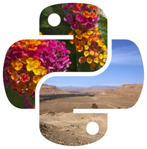

<!-- Improved compatibility of back to top link: See: https://github.com/othneildrew/Best-README-Template/pull/73 -->

<!--
*** Thanks for checking out the Best-README-Template. If you have a suggestion
*** that would make this better, please fork the repo and create a pull request
*** or simply open an issue with the tag "enhancement".
*** Don't forget to give the project a star!
*** Thanks again! Now go create something AMAZING! :D
-->

<!-- PROJECT SHIELDS -->
<!--
*** I'm using markdown "reference style" links for readability.
*** Reference links are enclosed in brackets [ ] instead of parentheses ( ).
*** See the bottom of this document for the declaration of the reference variables
*** for contributors-url, forks-url, etc. This is an optional, concise syntax you may use.
*** https://www.markdownguide.org/basic-syntax/#reference-style-links
-->

<!-- # Welcome -->

[![Contributors][contributors-shield]][contributors-url]
[![Achmad's LinkedIn][linkedin-shield]][linkedin-url]
[![Arifin's LinkedIn][linkedin-shield]][linkedin-url-2]

<!-- PROJECT LOGO -->
 

 

  <h3 align="center">Data Pre-Processing</h3>

  

    Data Pre-Processing
     
    <a href="https://github.com/baksara-id/baksara_dataset"><strong>Explore the docs »</strong></a>
     
     
    ·
    <a href="https://github.com/baksara-id/baksara_dataset/issues">Report Bug</a>
    ·
    <a href="https://github.com/baksara-id/baksara_dataset/issues">Request Feature</a>
  

<!-- TABLE OF CONTENTS -->

  
Table of Contents

  <ol>
    <li>
      <a href="#about-the-project">About The Project</a>
      <ul>
        <li><a href="#built-with">Built With</a></li>
      </ul>
    </li>
    <li><a href="#usage">Usage</a></li>
    <li><a href="#roadmap">Roadmap</a></li>
    <li><a href="#contact">Contact</a></li>
    <li><a href="#association">Association</a></li>
  </ol>

<!-- ABOUT THE PROJECT -->

## About The Project
### Project Summary

[![Product Name Screen Shot][product-screenshot]]()
This repository is part of Machine Learning Process. This repository will further become the main data to be used in training the model. This repository provides processed data that we have cleaned.

### Process Flow

[![System Graph][system-screenshot]]()
The picture above is the process that we work on. This repository phase is from the beginning `gathering dataset` until `train/dev/test split`.
 
- Gathering Dataset : We are collecting the dataset from <strong><a href="https://www.kaggle.com/datasets/phiard/aksara-jawa">kaggle</a></strong> and make a form using <strong><a href="https://www.jotform.com/">Jotform</a></strong>
- Extract Data from Jotform : After the Jotform already filled, we grant the data by using python to automate the process
- Image Cleaning : We are using the openCV and pillow to clean the image. We are doing grayscaling, binarization, edge detection, and resize the data into the supposed size.
- Data Augmentation : After clean the data, we are performing augmentation on the image. Rotating and scaling the image inside a canvas with size based on the input.
- Train/Dev/Test/ split : We are splitting the dataset to be used in Training phase.

<!-- CONTACT -->

## Contact

- Achmad Nashruddin Riskynanda - [LinkedIn][linkedin-url] - achmad.riskynanda01@gmail.com
- Theofilus Arifin - [LinkedIn][linkedin-url-2] - theofilusarifin@gmail.com

Project Link: [Click Here !](https://github.com/baksara-id/baksara_dataset)

(<a href="#readme-top">back to top</a>)

<!-- ACKNOWLEDGMENTS -->

## Association

- [Bangkit](https://grow.google/intl/id_id/bangkit/?tab=machine-learning)

(<a href="#readme-top">back to top</a>)

<!-- MARKDOWN LINKS & IMAGES -->
<!-- https://www.markdownguide.org/basic-syntax/#reference-style-links -->

[contributors-shield]: https://img.shields.io/github/contributors/baksara-id/graphql-api.svg?style=for-the-badge
[contributors-url]: https://github.com/baksara-id/graphql-api/graphs/contributors
[forks-shield]: https://img.shields.io/github/forks/baksara-id/graphql-api.svg?style=for-the-badge
[forks-url]: https://github.com/baksara-id/graphql-api/network/members
[stars-shield]: https://img.shields.io/github/stars/baksara-id/graphql-api.svg?style=for-the-badge
[stars-url]: https://github.com/baksara-id/graphql-api/stargazers
[issues-shield]: https://img.shields.io/github/issues/baksara-id/graphql-api.svg?style=for-the-badge
[issues-url]: https://github.com/baksara-id/graphql-api/issues
[license-shield]: https://img.shields.io/github/license/baksara-id/graphql-api.svg?style=for-the-badge
[license-url]: https://github.com/baksara-id/graphql-api/blob/master/LICENSE.txt
[linkedin-shield]: https://img.shields.io/badge/-LinkedIn-black.svg?style=for-the-badge&logo=linkedin&colorB=555
[linkedin-url]: https://www.linkedin.com/in/achmadnr9/
[linkedin-url-2]: https://www.linkedin.com/in/theofilusarifin/
[product-screenshot]: images/dataset_sample.jpeg
[system-screenshot]: images/flow_preprocess.png
[cicd-screenshot]: images/cicd.png
[db-screenshot]: images/db.png
[Next.js]: https://img.shields.io/badge/next.js-000000?style=for-the-badge&logo=nextdotjs&logoColor=white
[Next-url]: https://nextjs.org/
[React.js]: https://img.shields.io/badge/React-20232A?style=for-the-badge&logo=react&logoColor=61DAFB
[React-url]: https://reactjs.org/
[Vue.js]: https://img.shields.io/badge/Vue.js-35495E?style=for-the-badge&logo=vuedotjs&logoColor=4FC08D
[Vue-url]: https://vuejs.org/
[Angular.io]: https://img.shields.io/badge/Angular-DD0031?style=for-the-badge&logo=angular&logoColor=white
[Angular-url]: https://angular.io/
[Svelte.dev]: https://img.shields.io/badge/Svelte-4A4A55?style=for-the-badge&logo=svelte&logoColor=FF3E00
[Svelte-url]: https://svelte.dev/
[Laravel.com]: https://img.shields.io/badge/Laravel-FF2D20?style=for-the-badge&logo=laravel&logoColor=white
[Laravel-url]: https://laravel.com
[Bootstrap.com]: https://img.shields.io/badge/Bootstrap-563D7C?style=for-the-badge&logo=bootstrap&logoColor=white
[ApolloGraphQL.com]: https://img.shields.io/badge/-ApolloGraphQL-311C87?style=for-the-badge&logo=apollo-graphql
[ApolloGraphQL-url]: https://www.apollographql.com/
[Bootstrap-url]: https://getbootstrap.com
[JQuery.com]: https://img.shields.io/badge/jQuery-0769AD?style=for-the-badge&logo=jquery&logoColor=white
[JQuery-url]: https://jquery.com

